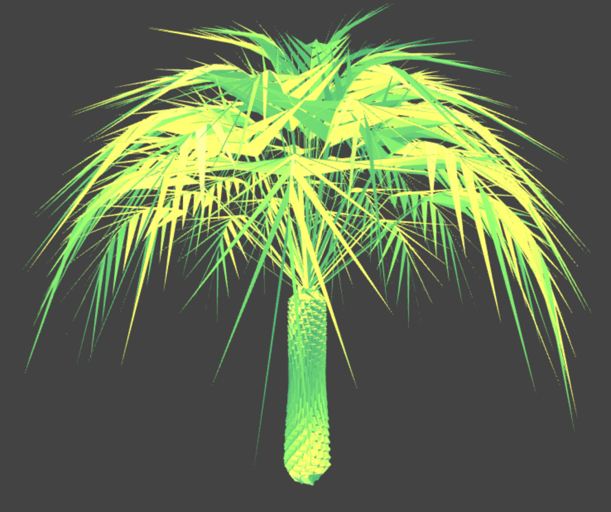
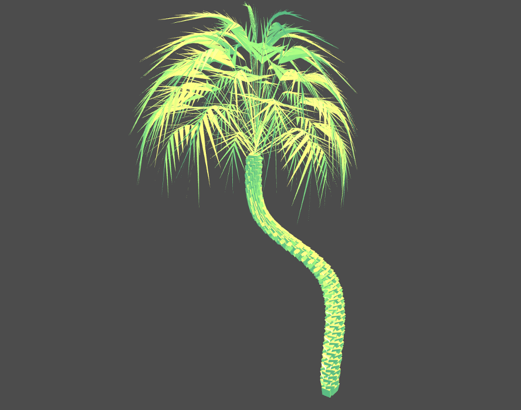

# Palm Generator

The Palm Generator is a Three.js module to create palms. For the moment it is in beta version, and it is available just as es6 class, but an npm package will arrive soon.
At this [website](http://davideprati.com/projects/palm-generator) You can see some example of which kind of palms it is able to create.

## Usage
This repository contains a usage example. In order to see it, `npm install`, `npm start`. If you want to include a palm done with this generator, copy the classes `PalmGenerator.js` and `phyllotaxis.js` in your source folder and follow this instructions. 

The palm generator constructor has the following signature:

```javascript
new PalmGenerator(leafGeometry, trunkGeometry, options, curve=false);
```

`leafGeometry`. Required. Has to be an instance of `THREE.Geometry`, and it is the geometry used for the leafs of the palm.

`trunkGeometry`. Required. Has to be an instance of `THREE.Geometry`, and it is the geometry used for the trunk of the palm. 

`options`. Optional. Is an object containing the options, defaults are provided
The available options are:

- `spread`. Float. It is the value that defines how much the objects that compose the palms should distantiate from each other. Keep it between 0 and 2.

- `angle` Float, degrees. It is the rotation angle that affects the phyllotaxis pattern. The default is the golden angle, 137.5,

- `num` Integer. It defines how many objects compose the palm. Keep it between 200 and 1000. The smaller, the faster.

- `growth`.Float. This value define how much the palm should grow along the y axis. With this generator

- `foliage_start_at`. Integer.It defines how many object will be leafs. It has to be a value smaller than `num`.

- `trunk_regular`. Boolean. It defines if the phyllotaxis will deform the trunk or not.

- `buffers`: Boolean. Highly experimental, default is false, updates will follow.

- `angle_open`: Float, degree. It defines the disclose angle of the leaves,

- `starting_angle_open` Float, degree. It defines from which angle the leave will start to disclose

`curve`. Optional. A CatmullRomCurve3 can be passed as last argument. The first vertex in the curve will define the position of the treetop, the last one will define the position of the part of the trunk that is attached to the ground. Look at the curve in `src/application.js` to have an idea about how to make palms alongside curves. 

The PalmGenerator returns an object containing the an instance of THREE.Geometry.

Example:

```javascript
let leafGeometry = new THREE.SphereGeometry(5, 20, 20);
let trunkGeometry = new THREE.BoxGeometry(5,5,5);
let palm = new PalmGenerator(leafGeometry,
                            trunkGeometry,
                            curve);
let geometry = palm.geometry;
let bufGeometry = new THREE.BufferGeometry().fromGeometry(geometry);
let mesh = new THREE.Mesh(bufGeometry, material);
scene.add( mesh );
```

## Enter LeafGeometry

The previous snippet generates a tree that looks weird. The trunk is fine but the foliage is really, ehm, abstract.
This is because the PalmGenerator accepts any kind of geometry, but probably a sphere isn't much adapt to draw a leave. In order to have leaves the looks like palm leaves, I've created a custom geometry, called `LeafGeometry`. You can dowload the class `LeafGeometry.js` from the [repository](https://github.com/edap/LeafGeometry) and put it into your source folder. We change the previous snippet as follows:

```javascript
let leaf_opt = {
    length: 60,
    length_stem: 20,
    width_stem: 0.2,
    leaf_width: 0.8,
    leaf_up: 1.5,
    density: 11,
    curvature: 0.04,
    curvature_border: 0.005,
    leaf_inclination: 0.9
};

let trunkGeometry = new THREE.BoxGeometry(5,5,5);
let leafGeometry = new LeafGeometry(leaf_opt);

let palm_opt = {
    spread: 0.1,
    angle: 137.5,
    num: 406,
    growth: 0.12,
    foliage_start_at: 56,
    trunk_regular: false,
    buffers: false,
    angle_open: 36.17,
    starting_angle_open: 50
};

let palm = new PalmGenerator(leafGeometry,
                            trunkGeometry,
                            palm_opt);
let geometry = palm.geometry;
let bufGeometry = new THREE.BufferGeometry().fromGeometry(geometry);
let mesh = new THREE.Mesh(bufGeometry, material);
scene.add( mesh );
```

The `leaf_opt` hash contains a bunch of options, you can have an idea about what each option is doing playing around with this [demo](http://davideprati.com/demo/LeafGeometry/).
The previous snippet shoulds generate a palm like this one:



## Curve

If we add a curve to the previous palm, passing an instance of a `CatmullRomCurve3` as fourth argument to the constructor, for example:

```javascript
var curve = new THREE.CatmullRomCurve3( [
      new THREE.Vector3( -40, 150, 0 ),
      new THREE.Vector3( -40, 100, 0 ),
      new THREE.Vector3( 0, 60, 0 ),
      new THREE.Vector3( 0, 0, 0 ),
] );

let palm = new PalmGenerator(leafGeometry,
                            trunkGeometry,
                            palm_opt,
                            curve);
```

A palm like the following is generated:




## Online Editor
If you want to generate your palm playing around with the parameters, try the [Palm Generator Online Editor]()


